# SecureNet (Detectome)

> A network security visualization and threat-propagation simulation platform — Final Year Project.

SecureNet is a cross-platform Flutter application that maps an organization's **virtual network topology** as a graph, identifies which devices are at risk when a node is compromised, and runs **agent-based simulations** to predict how a threat would spread under different network configurations. It applies concepts from graph theory and network science to help visualize and reason about network security.

---

## Table of Contents

- [Overview](#overview)
- [Features](#features)
- [Screenshots](#screenshots)
- [Architecture](#architecture)
- [Tech Stack](#tech-stack)
- [Project Structure](#project-structure)
- [Getting Started](#getting-started)
  - [Prerequisites](#prerequisites)
  - [Running the Flutter App](#running-the-flutter-app)
  - [Running the GraphQL Backend](#running-the-graphql-backend)
  - [Running the Simulation API](#running-the-simulation-api)
- [Configuration](#configuration)
- [Security Note](#security-note)
- [License](#license)

---

## Overview

The project is built around three core ideas:

1. **Virtual LAN visualization** — it renders the logical (virtual) network layout regardless of the physical wiring, so you can see how devices actually relate to one another.
2. **Risk analysis** — when a node is marked as suspected/compromised, the system identifies directly and indirectly affected nodes using graph relationships and network-science principles.
3. **Threat simulation** — it simulates how an infection (e.g. malware) propagates across the network under varying settings, so you can study the effect of changes to the network topology before applying them.

---

## Features

- **Authentication** — Sign up, log in, password reset, and change password via Firebase Authentication.
- **Network dashboard** — At-a-glance counts of routers, switches, servers, endpoints, suspected nodes, and infected nodes.
- **Network graph visualization** — Interactive force-directed graph of the network topology, with nodes colour-coded by device type.
- **Risk detection** — Classifies nodes as *Direct Risk*, *Indirect Risk*, or *Safe*, with risk scoring.
- **Risk-path analysis** — Surfaces multi-hop relationship paths through which a compromise can spread.
- **Device inventory** — Browse and search switches, servers, load balancers, and the endpoints connected to each switch.
- **Charts & analytics** — Node distribution and comparison charts (donut and bar charts).
- **Infection simulation** — Agent-based simulation of threat propagation with configurable parameters (infection probability, recovery chance, virus spread chance, outbreak size, resistance chance, and more).
- **Simulation analytics** — Live step-by-step stats, infection progression over time, infection by device type, and a final-state breakdown.
- **CSV export** — Export simulation results.
- **Settings** — Configure the Neo4j connection, network discovery, refresh intervals, alerts, and backups.
- **Theming** — Light and dark mode support.
- **Cross-platform** — Runs on Android, iOS, Web, Windows, macOS, and Linux from a single codebase.

---

## Screenshots

> The screenshots below are stored in the [`screenshots/`](screenshots) folder of this repository.

### Authentication

| Login | Sign Up | Reset Password |
|-------|---------|----------------|
| 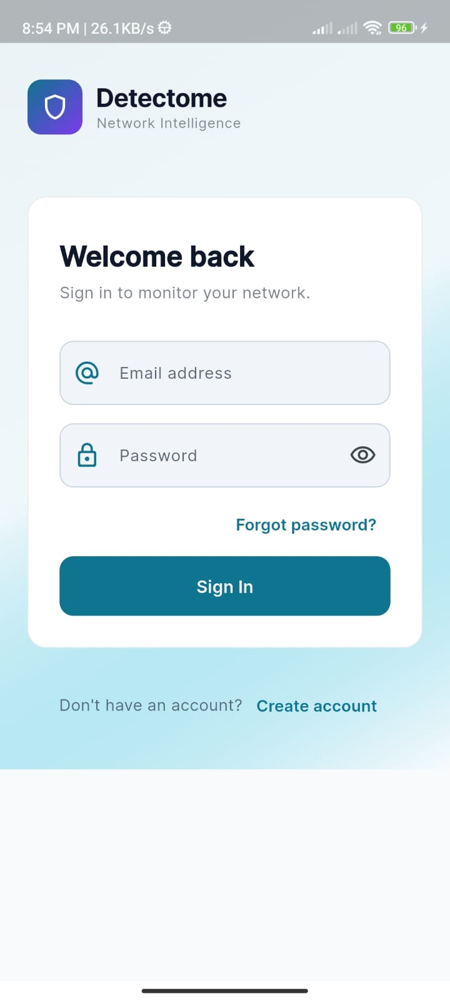 | 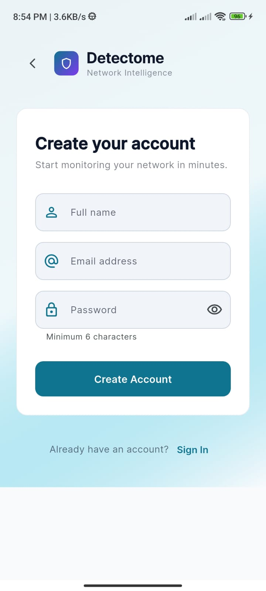 | 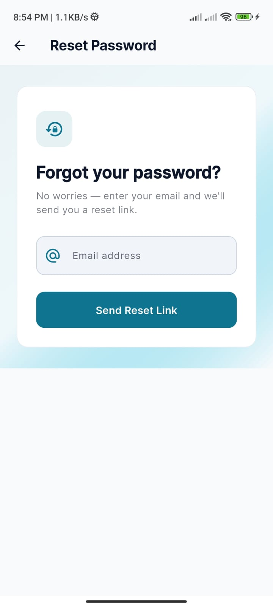 |

### Dashboard & Navigation

| Dashboard | Network Hub | Navigation Drawer |
|-----------|-------------|-------------------|
| 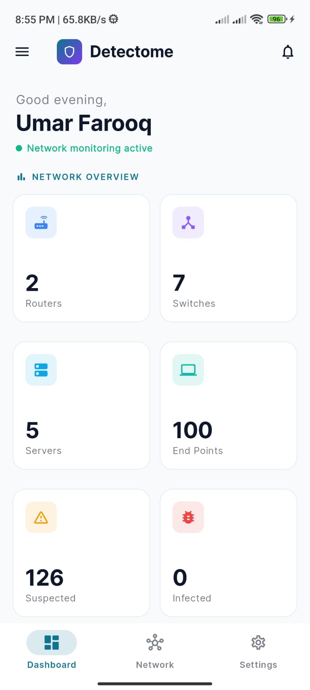 | 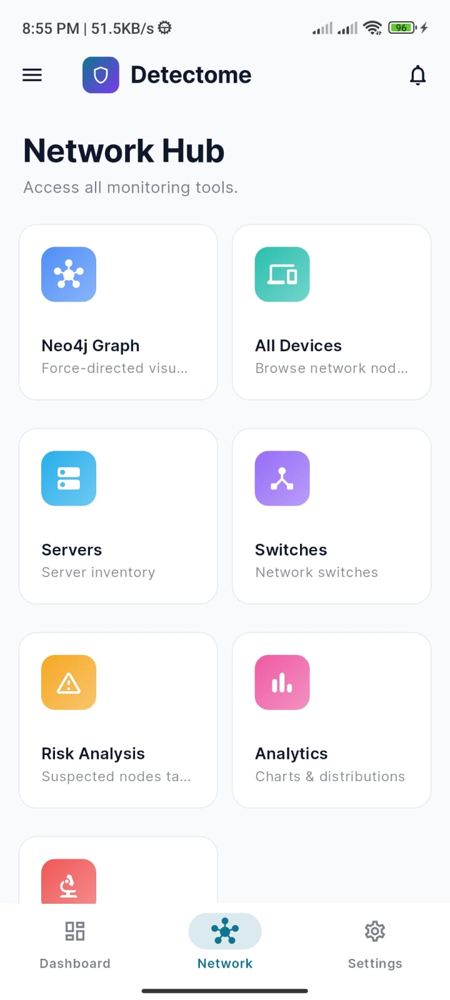 | 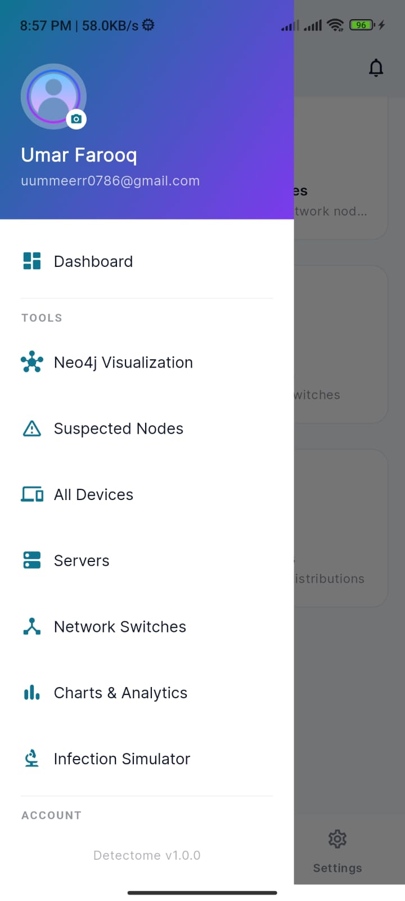 |

### Network Visualization & Devices

| Neo4j Graph | All Devices | Risk Analysis |
|-------------|-------------|---------------|
| 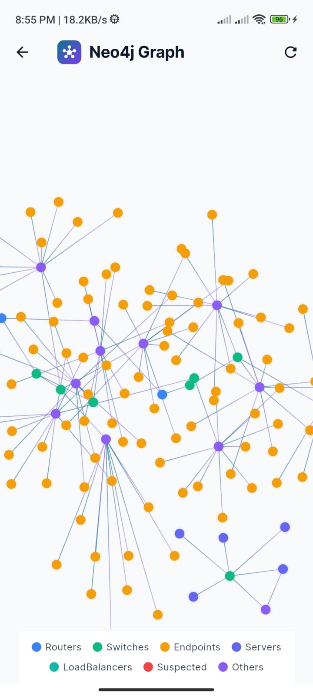 | 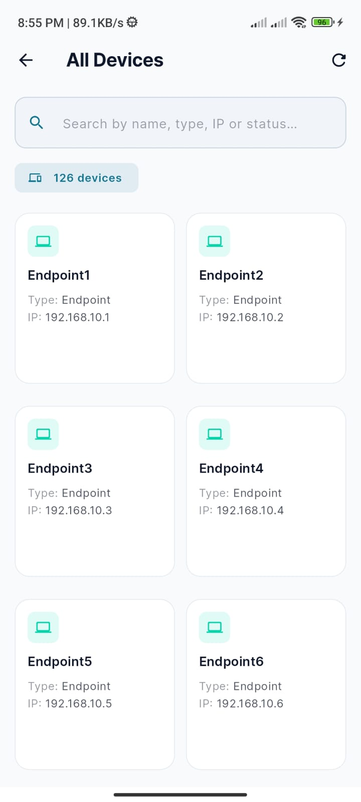 | 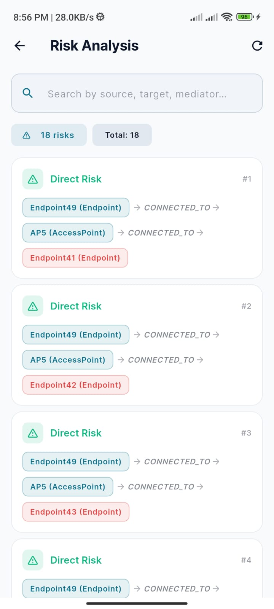 |

| Servers | Switches | Settings |
|---------|----------|----------|
| 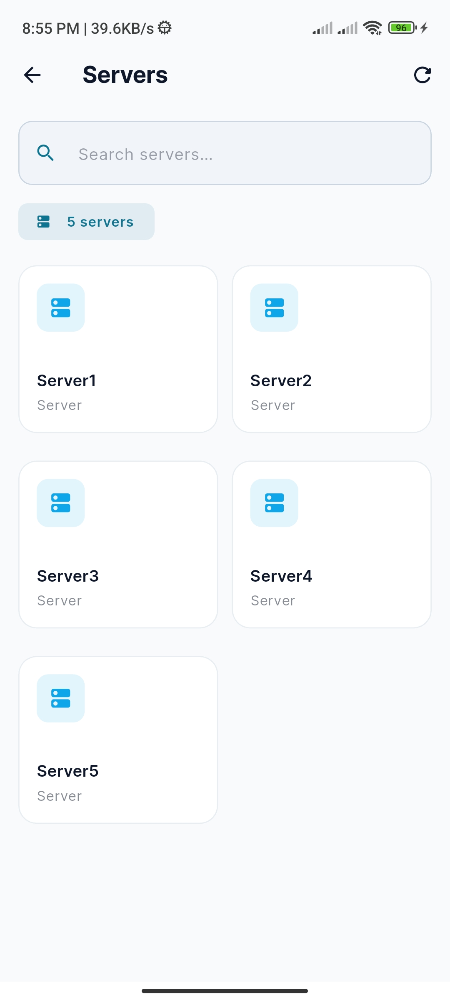 | 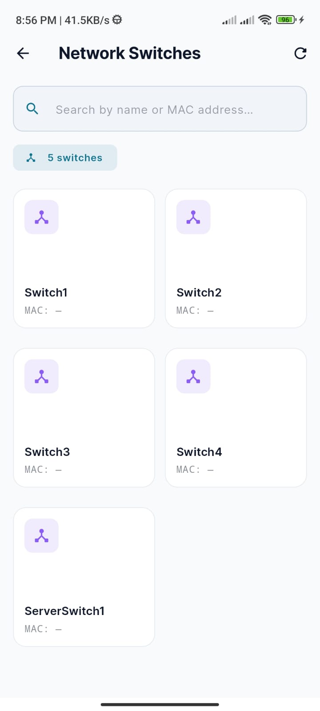 | 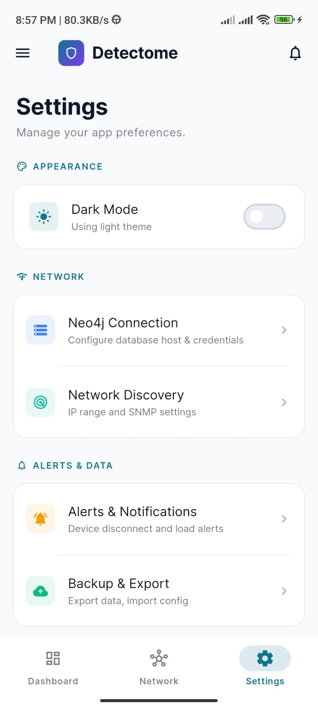 |

### Analytics

| Network Distribution | Node Count Comparison |
|----------------------|-----------------------|
| 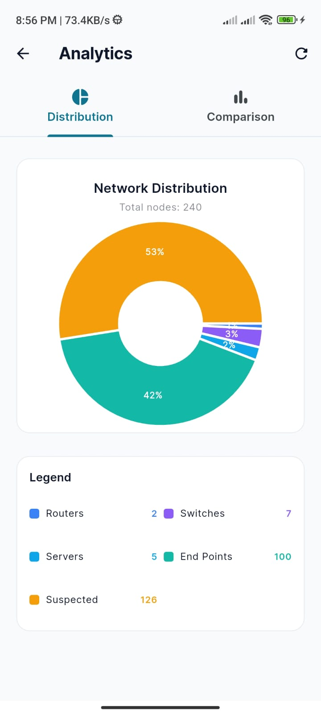 | 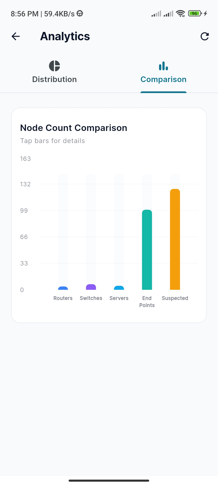 |

### Infection Simulator

| Configure Parameters | Simulation Results | Infection Progression |
|----------------------|--------------------|-----------------------|
| 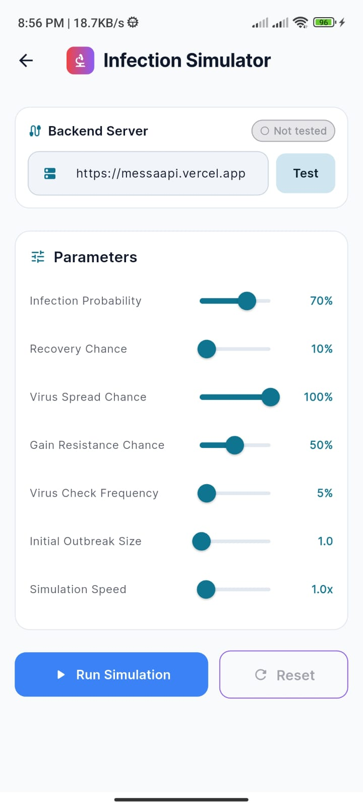 | 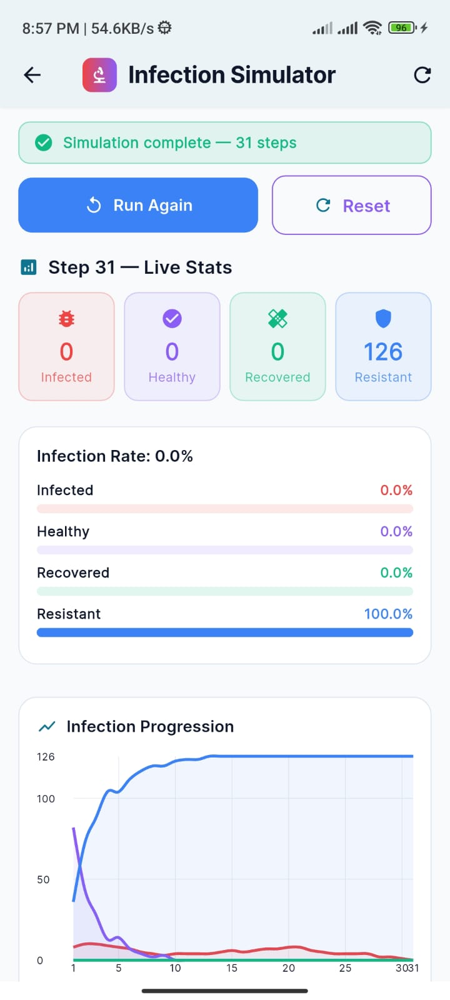 | 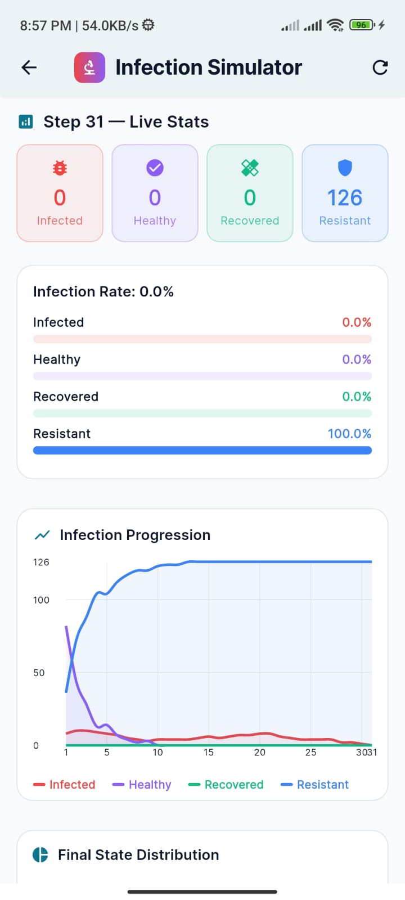 |

| Final State Distribution | Per-Device Status |
|--------------------------|-------------------|
| 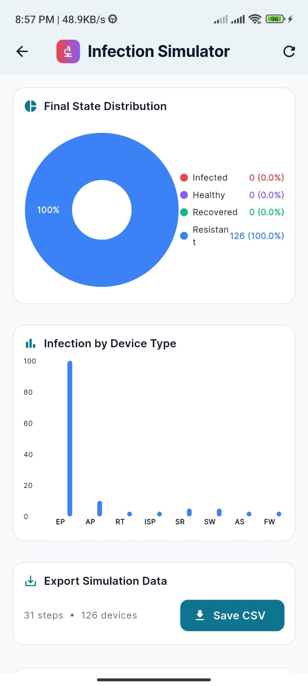 | 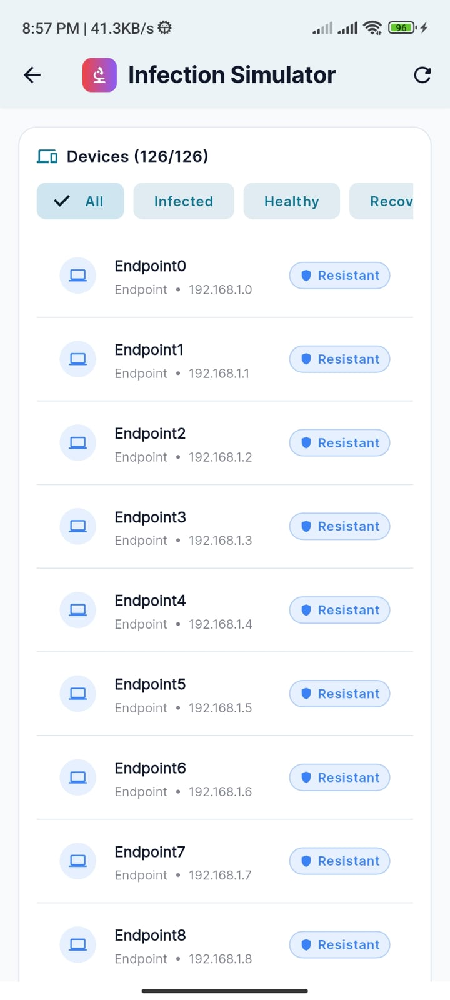 |

### Messa Simulation — Desktop Interface

The Messa simulation engine also ships with a standalone desktop interface for running and visualizing network infection models.

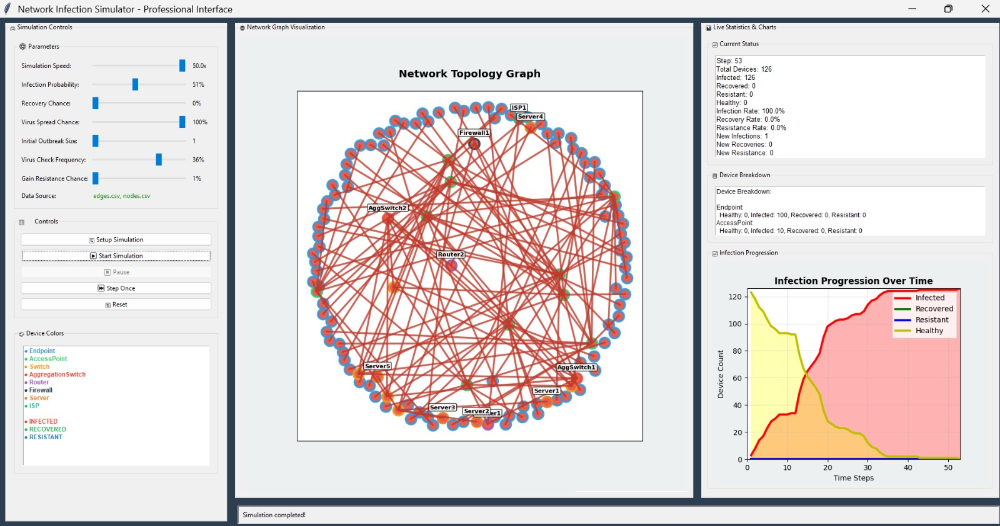

---

## Architecture

SecureNet has one frontend and two independent backend services:

```
            +-----------------------------+
            |   Flutter App (Detectome)   |
            |  Android / iOS / Web / etc. |
            +--------------+--------------+
                           |
            +--------------+---------------+
            |                              |
            v                              v
 +---------------------+      +--------------------------+
 |  GraphQL Backend     |      |  Messa Simulation API     |
 |  (FastAPI +          |      |  (FastAPI + Mesa)         |
 |   Strawberry GraphQL)|      |                           |
 |                      |      |  Agent-based infection    |
 |  Queries network     |      |  / propagation model      |
 |  topology & risk     |      |                           |
 +----------+-----------+      +--------------------------+
            |
            v
   +------------------+
   |   Neo4j (Aura)   |
   |  Graph Database  |
   +------------------+
```

- **Flutter app** — the user interface, also using Firebase for authentication, storage, and analytics.
- **GraphQL backend** (`Backened/`) — a FastAPI service exposing a Strawberry GraphQL API that runs Cypher queries against a Neo4j graph database to return nodes, relationships, and risk information.
- **Messa simulation API** (`messa/`) — a FastAPI service built on the [Mesa](https://mesa.readthedocs.io/) agent-based modeling framework that simulates how an infection spreads through the network.

---

## Tech Stack

**Frontend**
- Flutter (Dart, SDK `>=3.7.0 <4.0.0`)
- Provider (state management)
- Firebase (Auth, Cloud Firestore, Storage, Analytics, Remote Config)
- Graph visualization: `graphview`, `advanced_graphview`, `flutter_force_directed_graph`
- `fl_chart` for analytics, plus `webview_flutter`, `image_picker`, `flutter_local_notifications`

**Backend — GraphQL service**
- Python, FastAPI, Strawberry GraphQL, Uvicorn
- Neo4j graph database (queried with Cypher)

**Backend — Simulation service**
- Python, FastAPI, Mesa (agent-based modeling)
- NetworkX, pandas, NumPy

**Deployment**
- Both backends are configured for Vercel (serverless).

---

## Project Structure

```
securenet/
├── lib/                        # Flutter application source
│   ├── main.dart               # App entry point
│   ├── auth/                   # Login, signup, password screens
│   ├── charts/                 # Chart widgets
│   ├── forcedirectedgraph/     # Force-directed graph view
│   ├── listscreen/             # Device / switch / server lists
│   ├── nextsuspectednode/      # Next-suspected-node logic
│   ├── services/               # GraphQL client service
│   ├── setting/                # Settings screens (Neo4j, alerts, etc.)
│   ├── messa/                  # Simulation feature (models, providers, screens, widgets)
│   └── theme/                  # App theming
│
├── Backened/                   # GraphQL backend (FastAPI + Strawberry + Neo4j)
│   └── api/
│       ├── main.py             # FastAPI app + GraphQL router
│       ├── sch.py              # GraphQL schema & resolvers (Cypher queries)
│       └── db.py               # Neo4j connection
│
├── messa/                      # Simulation backend (FastAPI + Mesa)
│   ├── messa.py                # NetworkInfectionModel (agent-based model)
│   ├── api/index.py            # FastAPI wrapper for the simulation
│   ├── nodes.csv / edges.csv   # Sample network data
│   └── requirements.txt
│
├── screenshots/                # App & simulation screenshots (used in this README)
├── assets/                     # Images, icons, HTML
├── android/ ios/ web/ ...      # Platform-specific code
└── pubspec.yaml                # Flutter dependencies
```

---

## Getting Started

### Prerequisites

- [Flutter SDK](https://docs.flutter.dev/get-started/install) (3.7.0 or newer)
- [Python](https://www.python.org/) 3.10+
- A [Neo4j](https://neo4j.com/) database (Neo4j Aura works well)
- A [Firebase](https://firebase.google.com/) project

### Running the Flutter App

```bash
# Install dependencies
flutter pub get

# Run on a connected device or emulator
flutter run

# Or build for a specific platform
flutter build apk        # Android
flutter build web        # Web
```

### Running the GraphQL Backend

```bash
cd Backened
pip install -r requirements.txt

# Set your Neo4j credentials (see Configuration below)
uvicorn api.main:app --reload --port 8000
```

The GraphQL playground will be available at `http://localhost:8000/graphql`.

### Running the Simulation API

```bash
cd messa
pip install -r requirements.txt

uvicorn api.index:app --reload --port 8001
```

The simulation API will be available at `http://localhost:8001` (see `/health` for status).

---

## Configuration

The app and backends rely on a few external services. **Do not commit real credentials to the repository** — use environment variables or local config files that are git-ignored.

**Neo4j** (used by `Backened/api/db.py`):

```bash
export NEO4J_URI="neo4j+s://<your-instance>.databases.neo4j.io"
export NEO4J_USERNAME="neo4j"
export NEO4J_PASSWORD="<your-password>"
```

**Firebase** — configure your own Firebase project and set the options used in `lib/main.dart`. Generating `firebase_options.dart` via the [FlutterFire CLI](https://firebase.google.com/docs/flutter/setup) is recommended.

**Backend endpoints** — the Flutter app points to deployed backend URLs in `lib/services/graphql_service.dart` and `lib/messa/services/messa_api_service.dart`. Update these to match your own deployment or local servers.

---

## Security Note

This is an academic project. Before making the repository public or sharing it:

- **Rotate any credentials** that were committed to the repository (Neo4j password, etc.).
- Move all secrets out of source code and into environment variables.
- Restrict CORS in production — the backends currently allow all origins (`"*"`), which is fine for development but not for deployment.

---

## License

This project was developed as a Final Year Project. Add a license of your choice (e.g. MIT) if you intend to share or reuse it.

---

*Built with Flutter, FastAPI, Neo4j, and Mesa.*
